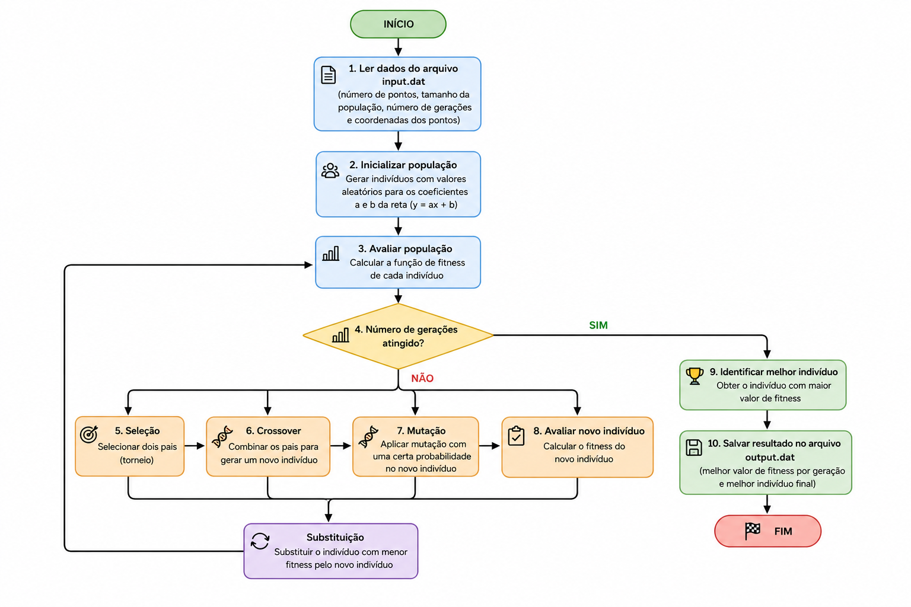

# Sistema de Biblioteca em Python


---

## 📚 Informações Acadêmicas

* **Aluno:** Jade Giulia Januaria de Souza
* **Professor:** Guilherme Soares
* **Faculdade:** CEFET-MG
* **Disciplina:** Python

---

## 📑 Sumário

* 🔎 [Introdução](#-introdução)
* 🧠 [Metodologia](#-metodologia)
* ⚙️ [Fluxo de Execução do Programa](#️-fluxo-de-execução-do-programa)
* 🗂️ [Estrutura do Projeto](#️-estrutura-do-projeto)
* 🧱 [Descrição das Classes](#-descrição-das-classes)
* ▶️ [Execução do Projeto](#️-execução-do-projeto)
* 📌 [Estado Atual do Projeto](#-estado-atual-do-projeto)
* 🚀 [Próximas Etapas](#-próximas-etapas)

---

# 🔎 Introdução

Este projeto foi desenvolvido como parte da disciplina de **Python** do **CEFET-MG**, com o objetivo de aplicar os principais conceitos de **Programação Orientada a Objetos (POO)** em um sistema realista de gerenciamento de biblioteca.

O sistema simula o funcionamento básico de uma biblioteca, permitindo o cadastro de livros e usuários, além do controle de empréstimos e devoluções.

O projeto foi estruturado de forma modular, separando responsabilidades em diferentes classes, permitindo maior organização, reutilização de código e facilidade de manutenção.

Além disso, o sistema foi planejado para evoluir em futuras etapas da disciplina, possibilitando a implementação de novos recursos e de uma interface gráfica.

---

# 🧠 Metodologia

A implementação do sistema foi baseada nos princípios da **Programação Orientada a Objetos**, utilizando classes para representar entidades reais do domínio da biblioteca.

Cada classe possui responsabilidades específicas dentro do sistema:

* a classe `Livro` representa os livros cadastrados;
* a classe `Usuario` representa os usuários da biblioteca;
* a classe `Emprestimo` representa os empréstimos realizados;
* a classe `Biblioteca` centraliza toda a lógica do sistema.

As informações são armazenadas temporariamente em listas dentro da memória do programa, permitindo o gerenciamento dos objetos durante a execução.

Durante o desenvolvimento, foram implementadas validações importantes para garantir o funcionamento correto do sistema, como:

* impedir livros duplicados;
* impedir usuários duplicados;
* bloquear empréstimos de livros indisponíveis;
* impedir empréstimos para usuários inativos.

Essa abordagem permite representar regras de negócio reais de forma simples e organizada.

---

# ⚙️ Fluxo de Execução do Programa



O fluxograma apresentado descreve o funcionamento geral do sistema de biblioteca implementado em Python.

Inicialmente, o programa cria a biblioteca principal e realiza o cadastro dos livros e usuários. Em seguida, os livros cadastrados podem ser listados e buscados por título ou autor.

Quando um empréstimo é solicitado, o sistema verifica se o livro está disponível e se o usuário está ativo. Caso as validações sejam satisfeitas, o empréstimo é registrado e o status do livro é atualizado automaticamente para indisponível.

Posteriormente, o sistema permite registrar a devolução do livro, restaurando sua disponibilidade no acervo da biblioteca. Durante toda a execução, o programa mantém o controle dos empréstimos ativos, permitindo sua listagem a qualquer momento.

Esse fluxo representa o ciclo completo de utilização do sistema implementado nesta primeira etapa do projeto.

---

# 🗂️ Estrutura do Projeto

O projeto foi organizado de forma modular, separando responsabilidades em diferentes arquivos.

```text
library-management-system/
│
├── livro.py
├── usuario.py
├── emprestimo.py
├── biblioteca.py
├── main.py
├── README.md
│
└── imagens/
    └── fluxograma.png
```

Essa estrutura facilita a manutenção, organização e evolução do sistema.

---

# 🧱 Descrição das Classes

## 📘 Classe Livro

A classe `Livro` representa um livro disponível no acervo da biblioteca.

### Responsabilidades

* armazenar informações do livro;
* controlar disponibilidade;
* fornecer descrição do livro.

### Principais atributos

| Atributo   | Descrição                         |
| ---------- | --------------------------------- |
| codigo     | Identificador único do livro      |
| titulo     | Nome do livro                     |
| autor      | Nome do autor                     |
| ano        | Ano de publicação                 |
| disponivel | Define se o livro está disponível |

### Principais métodos

#### `emprestar()`

Marca o livro como indisponível.

#### `devolver()`

Marca o livro como disponível novamente.

#### `descricao()`

Retorna todas as informações do livro formatadas.

---

## 👤 Classe Usuario

A classe `Usuario` representa um usuário cadastrado na biblioteca.

### Responsabilidades

* armazenar dados do usuário;
* controlar status do usuário;
* permitir empréstimos apenas para usuários ativos.

### Principais atributos

| Atributo  | Descrição                |
| --------- | ------------------------ |
| matricula | Identificador do usuário |
| nome      | Nome do usuário          |
| email     | E-mail do usuário        |
| ativo     | Status do usuário        |

### Principais métodos

#### `ativar()`

Ativa o usuário.

#### `desativar()`

Desativa o usuário.

#### `descricao()`

Retorna os dados do usuário.

---

## 📑 Classe Emprestimo

A classe `Emprestimo` representa o empréstimo de um livro para um usuário.

### Responsabilidades

* registrar empréstimos;
* registrar devoluções;
* armazenar datas;
* controlar empréstimos ativos.

### Principais atributos

| Atributo        | Descrição                         |
| --------------- | --------------------------------- |
| livro           | Livro emprestado                  |
| usuario         | Usuário responsável               |
| data_emprestimo | Data do empréstimo                |
| data_devolucao  | Data da devolução                 |
| ativo           | Indica se o empréstimo está ativo |

### Principais métodos

#### `registrar_devolucao()`

Finaliza o empréstimo.

#### `resumo()`

Retorna um resumo das informações do empréstimo.

---

## 🏛️ Classe Biblioteca

A classe `Biblioteca` é a principal do sistema.

Ela centraliza o gerenciamento de:

* livros;
* usuários;
* empréstimos.

### Responsabilidades

* cadastrar livros;
* cadastrar usuários;
* buscar livros;
* realizar empréstimos;
* registrar devoluções;
* listar informações do sistema.

### Principais atributos

| Atributo    | Descrição            |
| ----------- | -------------------- |
| nome        | Nome da biblioteca   |
| livros      | Lista de livros      |
| usuarios    | Lista de usuários    |
| emprestimos | Lista de empréstimos |

### Principais métodos

#### `adicionar_livro()`

Cadastra livros no sistema.

#### `cadastrar_usuario()`

Cadastra usuários.

#### `buscar_livros_por_titulo()`

Busca livros pelo título.

#### `buscar_livros_por_autor()`

Busca livros pelo autor.

#### `emprestar_livro()`

Realiza empréstimos com validações.

#### `devolver_livro()`

Registra devoluções.

#### `listar_emprestimos_ativos()`

Mostra todos os empréstimos ativos.

---

# ▶️ Execução do Projeto

Para executar o sistema:

```bash
python3 main.py
```

---

# 📌 Estado Atual do Projeto

Atualmente, o sistema possui:

* cadastro de livros;
* cadastro de usuários;
* busca por título;
* busca por autor;
* empréstimos;
* devoluções;
* controle de disponibilidade;
* listagem de empréstimos ativos.

O projeto corresponde à primeira etapa do desenvolvimento proposto na disciplina.

---

# 🚀 Próximas Etapas

O sistema foi planejado para evoluir futuramente com novas funcionalidades, como:

* persistência de dados;
* armazenamento em arquivos;
* banco de dados;
* menus interativos;
* interface gráfica;
* autenticação;
* histórico de empréstimos;
* melhorias de usabilidade.

Essas evoluções serão implementadas nas próximas etapas da disciplina.

---

## 💻 Autor

Desenvolvido por **Jade Giulia Januaria de Souza** durante a disciplina de **Python** no **CEFET-MG**.
